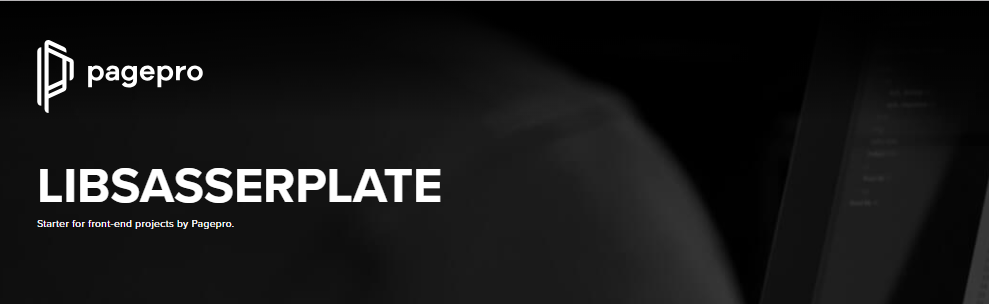

> **LibSass** starter for front-end projects by Pagepro.

# Requirements
1. [node v8.12.0 or later](https://nodejs.org/en/)
2. [yarn](https://yarnpkg.com/)
3. [EditorConfig](https://editorconfig.org/) for the code editor of your choice(optional).

# Getting started
Three simple steps to start:

1. Install the required libraries.
2. Get a copy of LibSasserPlate.
3. Install the dependencies if you don't already have them.

## Installing the required libraries

### [Node.js](https://nodejs.org)
If you require Node, go to [nodejs.org](https://nodejs.org) and click on the big green Install button.

If you have node already installed on your OS, please make sure you have a supported version running. To check node's version, open a terminal and run:
```sh
node --version
```
Node should respond with a version at or above 8.12.0. If the command is not recognized or nothing happens, you might want to re-install node.

## Getting the starter
[Download LibSasserPlate](https://github.com/Pagepro/libsasserplate/releases/latest) and extract it to catalog you want to work.


## Local dependencies
Next, install the local development dependencies required by LibSasserPlate. To do that, simply run:

```sh
$ yarn install
```

That's it! You should now have everything needed to use the LibSasserPlate.

# Usage

## Run development tasks:
To develop using LibSasserPlate, run: 
```shell
yarn start
```
This will start a local server and watch files for changes.  

## Build production files:

```shell
yarn run production
```

# Directory structure explanation

* **/** - root directory with html files and configuration files (eslint, editorconfig)
* **src** - directory with source files
* **static** - directory compiled files, do not edit files in this directory because they will be overwritten
